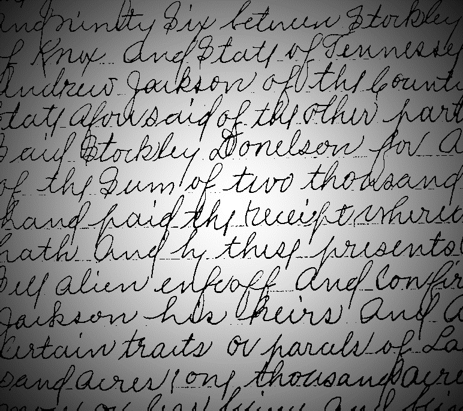

### 可视化作业2——保留中心点补充报告

经过验证，保留中心点后代码仍能取得相同去阴影结果

```python
from PIL import Image
import numpy as np
import copy


def local_thresh(image, fringe):
    shape_y, shape_x = image.shape
    new_image = copy.deepcopy(image)
    total_sums = {}  # storage previous computed sum
    for y in range(shape_y):
        for x in range(shape_x):
            if (x-1, y) in total_sums:      # left to right
                total_sum = total_sums[(x-1, y)]
                remove_sum = np.sum(image[max(y-fringe, 0): min(y+fringe, shape_y), x-1-fringe], dtype='int32')\
                    if x-1-fringe >= 0 else 0
                extend_sum = np.sum(image[max(y-fringe, 0): min(y+fringe, shape_y), x+fringe], dtype='int32')\
                    if x+fringe < shape_x else 0
                total_sum = total_sum - remove_sum + extend_sum

            elif (x, y-1) in total_sums:    # up to down
                total_sum = total_sums[(x, y-1)]
                remove_sum = np.sum(image[y-1-fringe, max(0, x-fringe):min(x+fringe, shape_x)], dtype='int32')\
                    if y-1-fringe >= 0 else 0
                extend_sum = np.sum(image[y + fringe, max(0, x-fringe):min(x+fringe, shape_x)],
                                    dtype='int32')\
                    if y + fringe < shape_y else 0
                total_sum = total_sum - remove_sum + extend_sum
            else:
                total_sum = np.sum(image[max(y-fringe, 0): min(y+fringe, shape_y), max(
                    0, x-fringe):min(x+fringe, shape_x)], dtype='int32')  # compute from None

            # save in each step
            total_sums[(x, y)] = total_sum
            around_sum = total_sum   # - image[y][x] 改动即为注释掉此处，不去除中心点
            threshold = around_sum / \
                ((min(x+fringe, shape_x)-max(0, x-fringe)) *
                 (min(y+fringe, shape_y)-max(y-fringe, 0))-1)
            new_image[y][x] = 255 if image[y][x] >= 0.4 * threshold else 0

    return new_image


# im = Image.open("./article_round.png")
im = Image.open("./article_line.png")
im = im.convert('L')
image = np.array(im)
H, W = image.shape
new_image = local_thresh(image, 45)
new_im = Image.fromarray(new_image)
if new_im.mode == 'F':
    new_im = new_im.convert('L')
# new_im.save("./threshold_article_round.jpg")
new_im.save("./threshold_article_line.jpg")


```

结果：

| Origin Image                          | Processed Image                                              |
| ------------------------------------- | ------------------------------------------------------------ |
|  |     |
|   | /%E5%A4%8D%E6%97%A6%E5%AD%A6%E4%B9%A0%E8%B5%84%E6%96%99/%E5%A4%A7%E5%9B%9B%E4%B8%8B/%E6%95%B0%E6%8D%AE%E5%8F%AF%E8%A7%86%E5%8C%96/%E5%8F%AF%E8%A7%86%E5%8C%96%E4%BD%9C%E4%B8%9A2/threshold_article_line.jpg?lastModify=1586230163) |