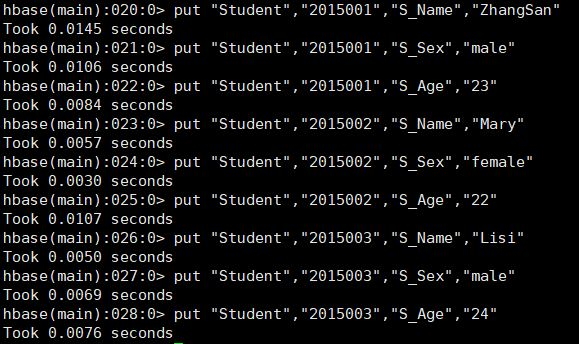
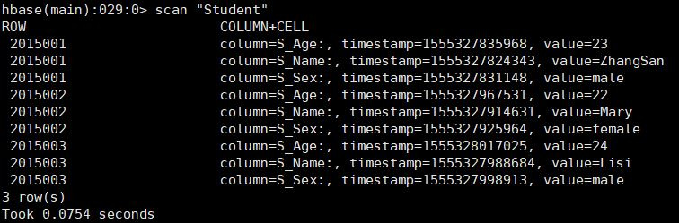
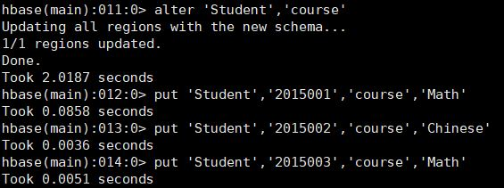
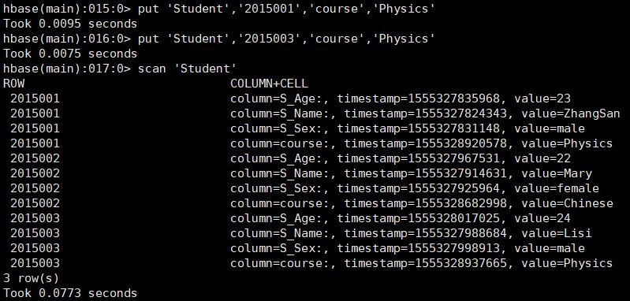
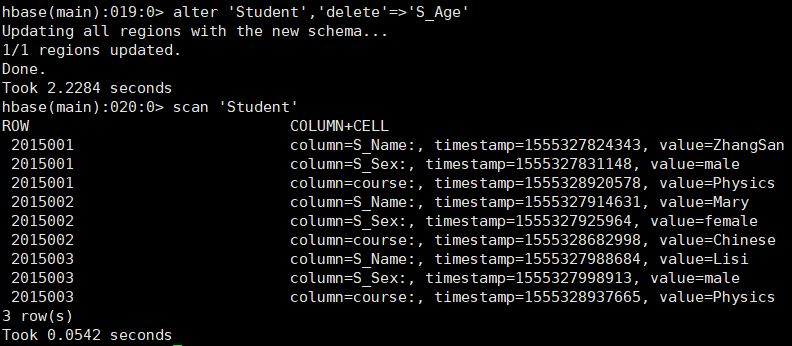
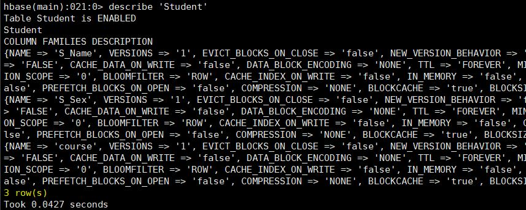

### 大规模分布式系统第五次作业——HBase的增删改查

##### 16300200020 张言健

#### 1. HBase的增删改

插入表中数据

```shell
create 'Student','S_Name','S_sex','S_Age'
```




##### task1. 列出HBase 所有的表的相关信息


##### task2. 在终端打印出学生表的所有记录数据



##### task3. 向学生表添加课程列族



##### task4. 将课程列族中的数学更换为物理



##### task5. 统计表的行数


\复旦学习资料\大三下\分布式系统\第五次作业\count.JPG

##### task6. 删除年龄列



##### task7. 统计表的列数




#### 2. 两表的自然拼接

给定两个表的信息

##### N1.txt 

```
01 沐川文化艺术中心
02 上海浦东足球场
03 复合体育观演中心
```

##### D1.txt

```
2014/10/21  07:30         3,395,145 01-01 一层平面图.dwg
2014/10/21  07:29           924,099 01-02 二层平面图.dwg
2014/10/21  07:29           935,215 01-03 三-九层、十二-十五层平面图.dwg
```

**由于在windows下载的两个文件并不是utf-8编码，因此需要先进行转换才能处理**，否则会有如下报错

```
UnicodeDecodeError: 'utf-8' codec can't decode byte 0xe3 in position 3: invalid continuation byte
```

#####  mapper.py

```python
import sys
import io
import os
input_stream = sys.stdin
# the map_input_file will be set by hadoop
# filepath = os.environ["map_input_file"]  #也可使用map_input_file为“N1”或“D1”区别两个文件
# filename = os.path.split(filepath)[-1]
for line in input_stream:
    if line.strip()=="":
        continue
    # fields = line[:-1].split("\t")
    lineset = line[:-1].strip().split()
    # print(len(lineset))
    if len(lineset) == 2:  # 对于不规则的数据进行删除，此处使用词条个数来判断，便于本地测试
        location = lineset[1]
        idx = lineset[0]
        print(idx,"0",location)
        
    if len(lineset) > 4:
        date = lineset[0]
        time = lineset[1]
        filescale = lineset[2]
        subidx = lineset[3][3:5]
        idx = lineset[3][:2]
        project = lineset[4]
        print(idx,"1","\t".join((date,time,filescale,subidx, project)))

```

##### reducer.py

```python
import sys
lastidx = ""
input_stream = sys.stdin
for line in input_stream:
    if line.strip() == "":
        continue
    lineset = line.strip().split()
    idx = lineset[0]
    if idx != lastidx:
        location = ""
        if lineset[1] == "0":  # 使用标记来源文件
            location = lineset[2]
    elif idx == lastidx:
        if lineset[1] == "1":
            date = lineset[2]
            time = lineset[3]
            filescale = lineset[4]
            subidx = lineset[5]
            file = lineset[6]
            if location:
                print("\t".join((lastidx, subidx, location, date, time, filescale, file)))
    lastidx = idx


```


##### 本地测试

\复旦学习资料\大三下\分布式系统\第五次作业\local.JPG)

##### Hadoop测试

##### run.sh

```shell
HADOOP_CMD="hadoop" #我的hadoop位置
STREAM_JAR_PATH="/usr/local/hadoop/share/hadoop/tools/lib/hadoop-streaming-2.8.5.jar" #streaming这个jar包的位置
INPUT_FILE_PATH_1="/join/input/*" #测试文件在hdfs中的位置。所以需要先将文件传入hdfs中
OUTPUT_PATH="/join/output" #文件输出目录（运行mr前一定不能存在，mr自己会创建）
 
$HADOOP_CMD fs -rmr -skipTrash $OUTPUT_PATH #删除原有的输出文件夹
 
#step 1.下面代码就是使用streaming框架的命令，具体参数就不解释了
$HADOOP_CMD jar $STREAM_JAR_PATH \
	-D mapred.map.tasks=3 \
	-D mapred.job.name="join_test" \
	-partitioner org.apache.hadoop.mapred.lib.KeyFieldBasedPartitioner \
        -input $INPUT_FILE_PATH_1 \
        -output $OUTPUT_PATH \
        -mapper "python3 mapper.py" \
        -reducer "python3 reducer.py" \
        -file ./mapper.py \
        -file ./reducer.py

```

\复旦学习资料\大三下\分布式系统\第五次作业\hadoop1.JPG)

\复旦学习资料\大三下\分布式系统\第五次作业\hadoop2.JPG)

测试成功


#### 3. 设计数据库

**连接后的数据表存⼊入Hbase数据库，请设计数据库rowkey和列**

数据库的设计：

| rowkeys | colume family                                                |                                               |
| ------- | ------------------------------------------------------------ | --------------------------------------------- |
|         | info                                                         | value                                         |
|         | info: idx<br/>info: sub_idx<br/>info: location<br/>info: date<br/>info: time<br/>info: file_scale<br/>info: file | idx<br/>sub_idx
location
date
time
file_scale
file |

每个数据单元的结果包含（idx，location, date, time, file_scale, sub_idx）

**实现按文件名和项目编号可快速查询到文件信息**

我们使用Thrift以及HappyBase来进行数据的处理，Apahce Thrift是FaceBook实现的一种高效的、支持多种语言的远程服务调用的框架。HappyBase是一个开发人员友好的Python库，可与HBase进行交互。

安装Thrift与HappyBase

```shell
wget https://www-us.apache.org/dist/thrift/0.12.0/thrift-0.12.0.tar.gz
tar -zxvf thrift-0.12.0.tar.gz
cd thrift-0.12.0/
./configure
make
make install
pip install thrift
pip install happybase
```

将已经处理的数据迁移到本地文件中

```shell
hdfs dfs -cat /join/output/* > output
```

hbase.py

```python
import happybase
#连接数据库,ip地址取决于本地端口
connection = happybase.Connection('0.0.0.0')
connection.open()
connection.create_table(
    'mytable',
    {
        'info': dict()
    }
)
# rowkeys 采用递增顺序
rowkey = 1
# 生成 mytable 的连接
table = connection.table('mytable')
with open(r"output","r") as file:    # we can use scan 'myTable' to see the result
    line = file.readline().strip().split()
    while(line):
        [idx, subidx, name, date, time, filescale,  project] = line
        data = {
            'info:idx':idx,
            'info:sub_idx': subidx,
            'info:name': name,
            'info:date': date,
            'info:time': time,
            'info:file_scale': filescale,
            'info:project':  project
        }
        # print(data)
        table.put(str(rowkey),data)
        rowkey+=1
        line = file.readline().strip().split()
```

在交互式界面中输入如下字符即可得到查询结果：

\复旦学习资料\大三下\分布式系统\第五次作业\search.JPG)

此时数据库中保存的是十六进制的序列，我们可以用utf-8来解码

**按项目编号分组输出**

可以使用happybase的scan API来实现查询，输出结果如图，scan本身是返回一个generator对象，用list函数可以转换为python列表

\复旦学习资料\大三下\分布式系统\第五次作业\scanAPI.JPG)

**按图纸年份分组输出**

由于此时记录的date的格式为'y/m/d'，因此使用年份作为开头的正则表达式可以提取出结果

\复旦学习资料\大三下\分布式系统\第五次作业\scanAPI2.JPG)