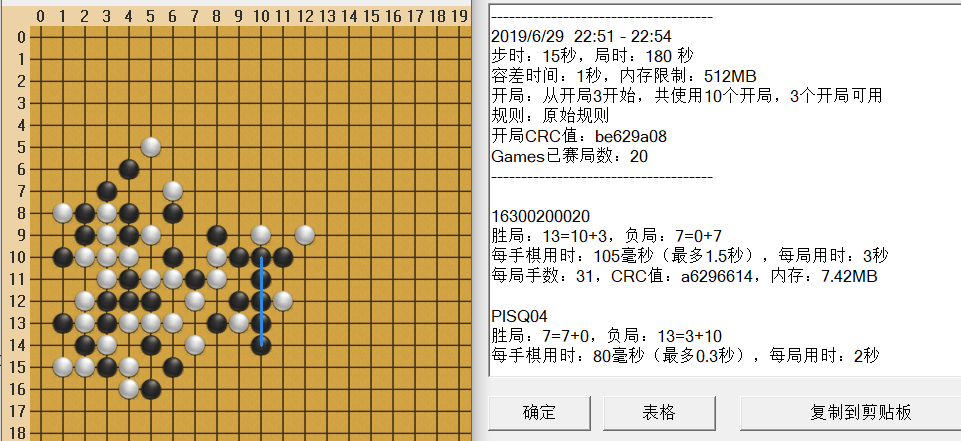
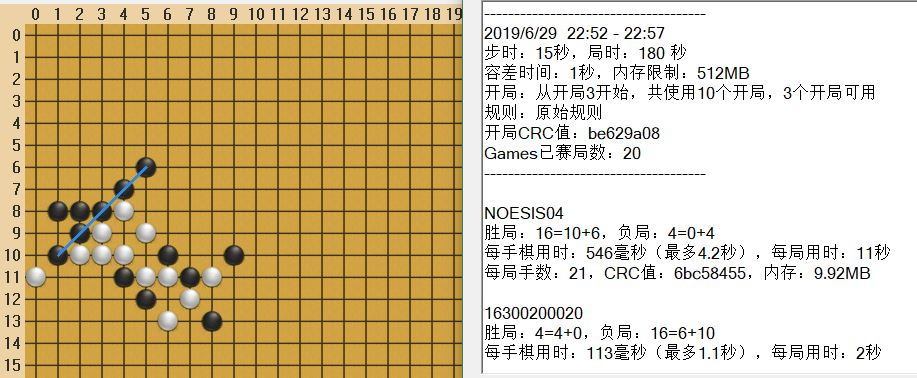

## Gomoku AI

We used the reinforcement learning + threat sequence + custom strategy (we call it "Qi") to generate our Gomoku AI, the final version (zip file) can beat pisq7 with a 13:7 advantage in a fixed start, 4: The disadvantage of 16 is inferior to Noesis.

Part of the code with Eval at the beginning is the part that uses the already trained weights to generate the model, so in the end our version is generated by the following command
Pyinstaller.exe .\EvalExample.py pisqpipe.py --name pbrain-eval-log3.exe --onefile
The part without Eval is part of the code used to train the neural network.

Gomoku manager piskvork can be seen from [Gomocup websites] (http://gomocup.org)
