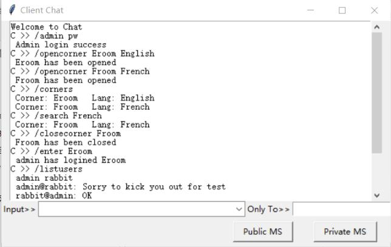

# Chat-room-in-UDP
这是计算机网络课程的PJ, 我使用python的UDP编程实现一个外语角的聊天室，并用tkinter实现了GUI界面

#### Usage_doc.pdf为用户手册，包含的内容如下：

1 编写的目的和范围

2 软件概述

3 服务器端使用说明

4 客户端使用说明

&emsp;4.1 管理员指令

&emsp;&emsp;4.1.1 管理员指令列表

&emsp;&emsp;4.1.2 逐条指令界面展示

&emsp;4.2 用户指令

&emsp;&emsp;4.2.1 用户指令列表

&emsp;&emsp;4.2.2 逐条指令界面展示

5 Q&A

效果展示：

1. 下拉框寻找指令前缀

2. admin指令逐条展示

3. 以上指令同时期的用户 rabbit 的界面
4. 普通用户界面

#### Designed_doc为设计文档，包含的内容如下

第一部分引言

1 编写的目的和范围

2 运行环境

3 数据结构说明

&emsp;3.1 常量

&emsp;3.2 数据结构

第二部分功能设计说明

4 协议模块

5 服务器模块

&emsp;5.1 普通客户端功能模块

&emsp;&emsp;5.1.1 功能描述

&emsp;&emsp;5.1.2 函数说明

6 客户端模块4

&emsp;6.1 管理员功能模块

&emsp;&emsp;6.1.1 功能描述

&emsp;&emsp;6.1.2 管理员身份验证

&emsp;&emsp;6.1.3 函数说明

&emsp;6.2 基本功能模块

&emsp;&emsp;6.2.1 功能描述

&emsp;&emsp;6.2.2 逻辑模块

&emsp;&emsp;6.2.3 GUI 模块

&emsp;6.3 用户体验增进设计

&emsp;&emsp;6.3.1 聊天室消息隐藏客户端输入

&emsp;&emsp;6.3.2 回车键快速判断消息类别

&emsp;6.4 组合下拉栏指令选择

第三部分接口设计说明

7 与客户端交互的接口设计

&emsp;7.1 错误命令输入反馈

&emsp;7.2 控制客户端链接的切断

8 防重复登陆机制