###金融与经济大数据挖掘作业——基于混合正态分布的EGARCH模型

##### 16300200020 张言健

##### 数据说明

低频日数据：沪深300-恒生指数-标准普尔

|          | 时间 | 开盘价 | 最高价  | 最低价 | 收盘价 |
| -------- | ---- | ------ | ------- | ------ | ------ |
| 沪深-300 | time | op_sh  | high_sh | low_sh | cl_sh  |
| 恒生指数 | time | op_hs  | high_hs | low_hs | cl_hs  |
| 标准普尔 | time | op_sp  | high_sp | low_sp | cl_sp  |

高频5分钟数据：台湾指数期货与现货

| 日期时间 | 期货          | 现货       |
| -------- | ------------- | ---------- |
| dateid   | index_futures | index_spot |

##### 建立单变量的基于混合正态分布的AR-EGARCH模型

EGARCH模型是考虑杠杆效应GARCH模型，其基本形式为：

$$r_t = \mu_t + \alpha_t $$

$$\alpha_t = \delta_t\varepsilon_t$$ , $$\varepsilon_t \in N(0, \delta_t)$$

$$\ln \left( \sigma _ { t } ^ { 2 } \right) = \alpha _ { 0 } + \sum _ { i = 1 } ^ { p } \alpha _ { i } \ln \left( \sigma _ { t - i } ^ { 2 } \right) + \sum _ { j = 1 } ^ { q } \beta _ { j } g \left( \varepsilon _ { t - j } \right)$$

其中 $g \left( \varepsilon _ { t } \right) = \left\{ \begin{array} { l } { ( \theta + \gamma ) \varepsilon _ { t } - \gamma E \left| \varepsilon _ { t } \right| , \varepsilon _ { t } \geq 0 } \\ { ( \theta - \gamma ) \varepsilon _ { t } - \gamma E \left| \varepsilon _ { t } \right| , \varepsilon _ { t } < 0 } \end{array} \right.$


由于随机时间序列变量常具有厚尾特征，上述条件均值$\varepsilon_t$的处理可以服从正态分布外， 还可服从能够刻画厚尾性的混合正态分布。

混合正态分布的概率密度函数为

$$\varepsilon _ { t } \sim i .i . d . \quad M N ( \xi , p ) = \left\{ \begin{array} { l l } { N \left( 0 , \sigma ^ { 2 } \right) } & { 1 - p } \\ { N \left( 0 , \xi \sigma ^ { 2 } \right) } & { p } \end{array} \right.$$

其中, $0<\xi<1$, $\sigma^2 = (1-p+\xi p)^{-1}$ , $Var(\varepsilon_t) = 1$

故 $\varepsilon_t$ 的混合正态分布概率密度函数为

$$f\left(\varepsilon_{t}\right)=\frac{p}{\sqrt{2 \pi \xi \sigma^{2}}} \exp \left(-\frac{\varepsilon_{t}^{2}}{2 \xi \sigma^{2}}\right)+\frac{1-p}{\sqrt{2 \pi \sigma^{2}}} \exp \left(-\frac{\varepsilon_{t}^{2}}{2 \sigma^{2}}\right)$$


**低频数据以沪深100指数为例**

1. 序列描述性分析

   在视图中点击View-graph-line，得到如下图

   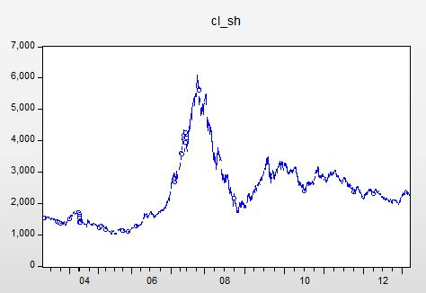

2. 考察序列的平稳性

   可以使用根检验来考察平稳性，点击View-Unit Root Test，Test Type选择Augmented Dickey-Fuller

   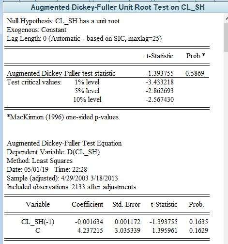

   可以看出原始时间序列不平稳，需要对原始时间序列进行一阶差分后再检验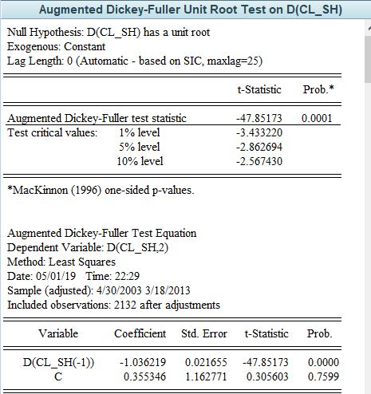

   t统计量-47,85，对应P值接近0，可以看出此时时间序列已经平稳

3. 序列的自相关性和偏自相关性检验

   在视图中点击View-correlogram，选择1st difference(我们刚刚检验过)，将滞后阶数Lags to include设置为12

   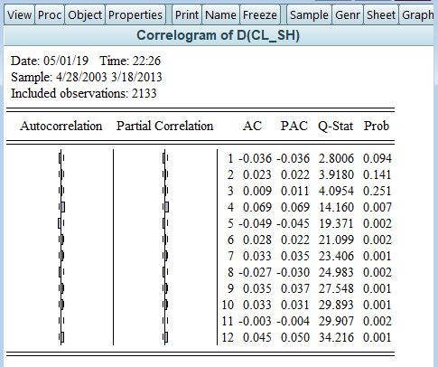

   由于序列不存在显著的相关性，因此将均值方程设定为白噪声。

   首先我们获得一阶差分的结果：

   $$d_t = r_t-r_{t-1}$$ , 存入新的序列dcl_sh中，具体操作为Quick/Generate Series，输入如下表达式

   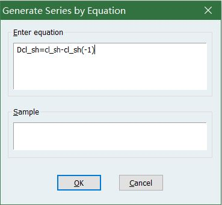

   新序列dcl_sh的综合信息如下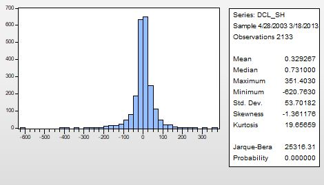


   设立模型 $$d_t = \pi_t + \varepsilon_t$$

   CL_SH去均值化，得到w, 具体操作为Quick/Generate Series输入

   w=dcl_sh-0.329267，新序列w的综合信息如下

   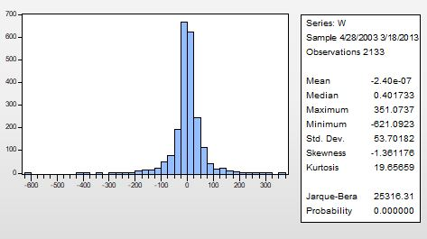

4. 检验ARCH效应

   检验ARCH效应有两种方法：LM法（拉格朗日乘数检验法）和对残差的平方相关图检验。在此我们采用第二种方法。

   首先建立w的平分方程z，在Quick/Generate Series输入z=w*w，然后在视图中点击view-correlogram，得到如下结果

   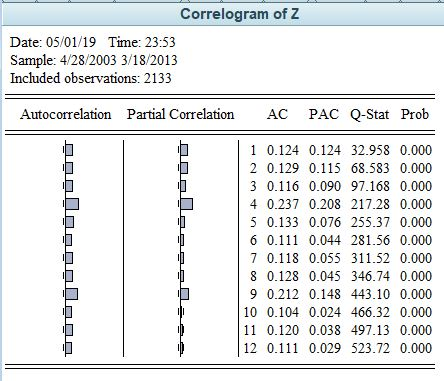


   序列存在自相关，所以有ARCH效应。

5. 建立GARCH模型

   常用的GARCH模型包括GARCH(1,1)，GARCH(1,2)，GARCH(2,1)

   尝试GARCH(1,1), 使用Quick/Estimate Equation，设置Method为ARCH，Model为GARCH, Order中ARCH与GARCH填（1,1），可得结果如下

   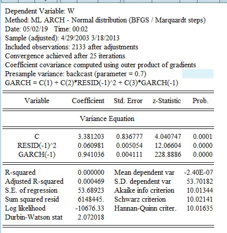

   所有系数都通过检验，因此GARCH（1,1）可以用于建模

6. 建立E-GARCH模型

   建立EGARCH(1,1), 使用Quick/Estimate Equation，设置Method为ARCH，Model为EGARCH, 得到如下结果

   

   EGARCH(1,1)模型的参数均显著，说明序列具有杠杆性。

7. 检验ARCH-M过程

   进一步加入“ARCH-M”检验，配置时将ARCH-M设置为“std-dev”或者“variance”,  “std-dev”结果如下

   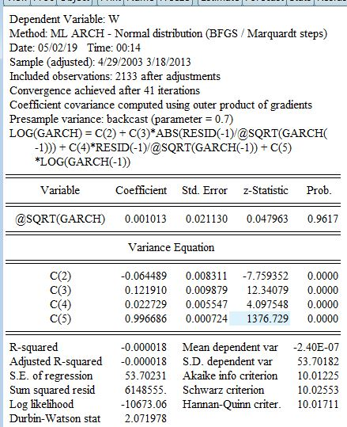

    “variance”结果如下

   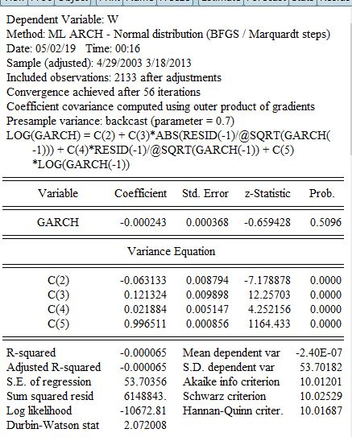

   可以看出其结果均不显著，说明不存在ARCH-M过程

8. 模型验证

   对建立的EARCH(1，1)模型进行残差ARCH效应检验，点击EARCH(1，1)结果输出窗口View /Residual Test /ARCH LM Test，将Lag依次设置为，1,4,8,12得到如下结果

   Lag=1

   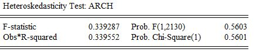

   Lag=4

   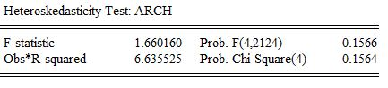

   Lag=8

   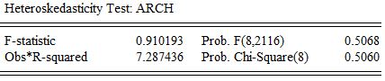

   Lag=12

   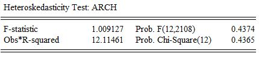

   在各种lag值情形下，F统计量均不显著，说明模型已经不存在ARCH效应。

   因而我们最终得到的模型为
   $$
   r_{t}-r_{t-1}=0.329267+a_{t}
   $$

   $$
   a_{t}=\sigma_{t} \varepsilon_{t}, \quad \varepsilon_{t} \sim N\left(\mathrm{O}, \sigma_{\varepsilon}\right)
   $$

   $$
   \ln \sigma_{t}^{2}=-0.064+0.122\left|\varepsilon_{t-1} / \sqrt{\sigma_{t-1}^{2}}\right|+0.023 \varepsilon_{t-1} / \sqrt{\sigma_{t-1}^{2}}+0.997^{*} \ln \sigma_{t-1}^{2}
   $$

9. 残差混合正态分布建模

   现在我们回到	w的综合信息这里，发现Jarque-Bera 统计量过大，对应概率为0，因此统计的正态分布检验没有通过，为此我们需要对厚尾特征进行建模，此处我们采用混合正态分布。

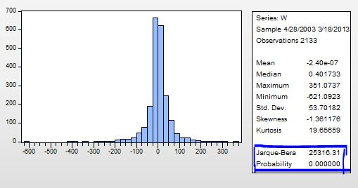

我们将w导出到txt文件中，使用python进行建模, arch_model的参数dist传入误差分布的名字

```python
from itertools import islice
file = open("./w.txt","r")
series = []
for line in islice(file,2,None):
    series.append(float(line.strip()))
# series
from scipy import  stats
import statsmodels.api as sm  # 统计相关的库
import numpy as np
import pandas as pd
import matplotlib.pyplot as plt
import arch  # 条件异方差模型相关的库
am = arch.arch_model(series, mean='zero', p=1, o=1,dist='StudentsT', q=1,vol = "EGARCH")
print(am.distribution('StudentsT'))
res = am.fit()
```

由于arch_model中没有关于混合正太分布的误差分布，因此我们对arch_model所在的mean.py文件以及它所调用的distribution文件进行修改

其中mean.py修改如下

```python
# append
from arch.univariate.distribution import (GeneralizedError, Normal,
                                          SkewStudent, StudentsT, MixNormal)
# decorate
def arch_model(y, x=None, mean='Constant', lags=0, vol='Garch', p=1, o=0, 			q=1, p_ = None,power=2.0, dist='Normal', hold_back=None ):# p_
    if dist in ('skewstudent', 'skewt'):
        d = SkewStudent()
    elif dist in ('studentst', 't'):
        d = StudentsT()
    elif dist in ('ged', 'generalized error'):
        d = GeneralizedError()
    elif dist in ('mix', 'mix norm'):
        d = MixNormal(p_)
    else:  # ('gaussian', 'normal')
        d = Normal()

```

distribution.py修改如下
$$
\sigma^{2}=(1-p+\xi p)^{-1} => \xi = \frac{(\sigma^2)^{-1}-1}{p}+1 => \xi\sigma^2 = \frac{1-\sigma^{2}}{p}+\sigma^2
$$

```python
class MixNormal(Distribution):
    """
    Standard normal distribution for use with ARCH models
    """

    def __init__(self, p_ , random_state=None):
        super(MixNormal, self).__init__('MixNormal', random_state=random_state)
        self.name = 'MixNormal' # 修改名称
        self.p_ = p_

    def constraints(self):
        return empty(0), empty(0)

    def bounds(self, resids):
        return tuple([])

    def loglikelihood(self, parameters, resids, sigma2, individual=False):
        # newsigma2 为 乘以xi之后新的sigma2，公式见上
        newsigma2 = abs(((1-sigma2)/self.p_)+sigma2)
        ll1 = (log(self.p_) -0.5 * (log(2 * pi) + log(newsigma2) + resids ** 2.0 / newsigma2))
        ll2 = (log(1-self.p_) -0.5 * (log(2 * pi) + log(sigma2) + resids ** 2.0 / sigma2))
        lls = log(exp(ll1)+exp(ll2))
        if individual:
            return lls
        else:
            return sum(lls)

    def starting_values(self, std_resid):
        return empty(0)

    def _simulator(self, size):
        return self._random_state.standard_normal(size)

    def simulate(self, parameters):
        return self._simulator

    def parameter_names(self):
        return []

    def cdf(self, resids, parameters=None):#过程不涉及此处
        return None

    def ppf(self, pits, parameters=None): # 过程不涉及此处
        return None
```


定义混合正太分布后，使用以下命令调用混合正态模型

```python
am = arch.arch_model(series, mean='zero', dist="mix", p=1, o=1, q=1, p_=0.5, vol = "EGARCH")
```


\复旦学习资料\大三下\金融与经济\LAB-2\mixnorm.JPG)

为了做对比，下面展示了正态分布所得结果

```python
am = arch.arch_model(series, mean='zero', dist="mix", p=1, o=1, q=1, p_=0.5, vol = "EGARCH")
```

\复旦学习资料\大三下\金融与经济\LAB-2\norm.JPG)）可以看到，混合正太分布的系数与正态分布的结果仅有微小差别，然而考虑了厚尾性的混合正态分布的结果t值更小（alpha、gamma、beta) 。


##### 高频数据以台湾指数期货为例

1. 序列描述性分析

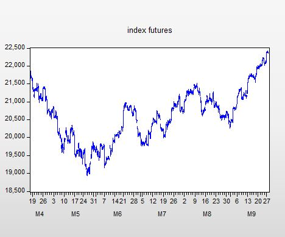

2. 考察序列的平稳性，原序列不平稳，进行一阶差分，下图为一阶差分结果，一阶差分平稳

   

3. 序列的自相关性和偏自相关性检验

   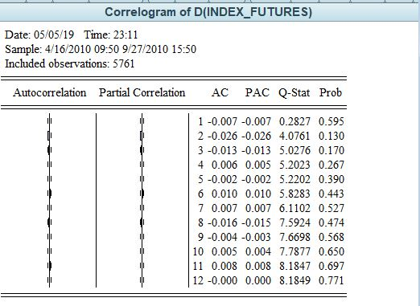

   存在自相关性。


   首先我们获得一阶差分的结果：

   $$d_t = r_t-r_{t-1}$$ , 存入新的序列dfuture中, 由于随机误差项之间有自相关性，因此不能进行去均值化

   4. 检验ARCH效应

      dfuture的平方的相关图检验 ：z=dfuture*dfuture

      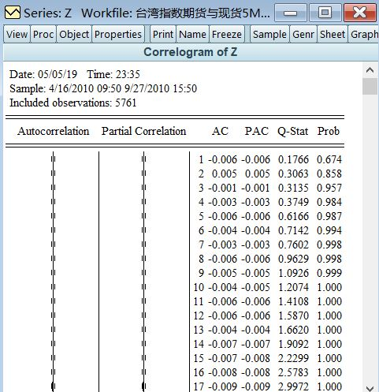

      不存在自相关性，没有ARCH效应，不适合建立ARCH类模型


      综上，我们在低频数据沪深100指数上建立了基于混合分布的EGARCH模型，在高频数据台湾指数期货中，我们发现其没有ARCH效应，因此不再建立ARCH类模型。


